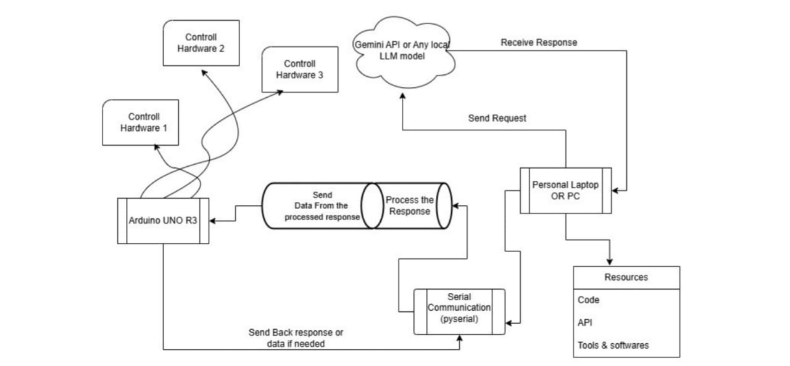

# 🤖 Arduino-AI Integration Demo

This is a **reference + working demo** project to integrate **voice-controlled AI** with **Arduino** via serial communication. It's designed to inspire custom voice-controlled hardware automation using natural speech without predefined command keywords.

✅ **No need to say exact keywords** like “turn on light” — just speak naturally (e.g., “Can you switch the lights on?”), and the AI will format it correctly using system instructions.

---

## 📌 Features

- 🗣️ Voice input using Vosk (offline)
- 🧠 AI responses using Gemini (Google Generative AI)
- 🔈 Text-to-speech using Coqui TTS (offline)
- 🔌 Real-time Arduino serial task execution
- ✅ No fixed command syntax required — natural language supported

---

## 🧩 How It Works

1. Voice input is captured and converted to text (via Vosk).
2. Gemini interprets the intent using a custom **system instruction** and outputs a formatted `CMD:` response.
3. That response is:
   - Spoken aloud (via Coqui TTS)
   - Sent over serial to Arduino
4. Arduino listens to the serial port and acts accordingly.

> 💬 Example:
> ```
> You: “Can you please rotate the motor by 90 degrees?”
> AI: “Sure. CMD: SERVO_R_90”
> Arduino receives: SERVO_R_90
> ```

---

## @ Flowchart

<p align="center">
  
</p>

---

## 🧰 Requirements

### 💻 Host (PC)
- Python 3.9+
- Python Packages:
  - `google-generativeai`
  - `vosk`
  - `pyaudio`
  - `pygame`
  - `torch`
  - `TTS` (Coqui)

- Vosk STT Model: [`vosk-model-small-en-us-0.15`](https://alphacephei.com/vosk/models)

### 🔌 Arduino
- Arduino UNO/Nano with Serial connection
- Arduino IDE

---

## 🛠️ Installation

### Clone This Repo
```bash
git clone https://github.com/fused-player/Arduino-Ai-Integration-Demo.git
cd Arduino-Ai-Integration-Demo
```

### Install Dependencies
```bash
pip install -r requirements.txt
```

### Export Your API Key
```bash
export GENAI_API_KEY="your_gemini_api_key"
```

---

## 🧠 Gemini AI Setup

The system prompt in the code teaches the AI how to respond to voice commands in a way that the Arduino can interpret without needing exact phrases. It outputs `CMD:` lines like:

- `CMD: LED_ON`
- `CMD: LED_OFF`
- `CMD: SERVO_R_45`
- `CMD: ANALOG_A0`
- `CMD: lblink_5_3`

These are picked up and sent to the Arduino directly.

---

## 📤 Arduino Code (Example)

```cpp
String input;
void setup() {
  Serial.begin(9600);
  pinMode(LED_BUILTIN, OUTPUT);
}

void loop() {
  if (Serial.available()) {
    input = Serial.readStringUntil('\n');
    input.trim();
    input.toLowerCase();

    if (input == "led_on") {
      digitalWrite(LED_BUILTIN, HIGH);
    } else if (input == "led_off") {
      digitalWrite(LED_BUILTIN, LOW);
    } else if (input.startsWith("servo_r_")) {
      // Extract and rotate servo
    }

    Serial.println(input + "_TASK_DONE");
  }
}
```

---

## 🔧 Set Arduino Port

In `shell_scripts.py`, set the correct serial port:
```python
SerialInst.port = '/dev/ttyACM0'  # or COM3 on Windows
```

---

## 🔌 How to Use

1. **Prepare Your Arduino**  
   - Write your own Arduino logic, or start with the provided sample.
   - Upload the code using the Arduino IDE.

2. **Configure Serial Port**
   - Open `shell_scripts.py`.
   - Set your Arduino port, e.g.:
     ```python
     SerialInst.port = '/dev/ttyACM0'  # or 'COM3' for Windows
     ```

3. **Customize System Instructions**
   - Open `main.py`.
   - Edit the system prompt (starting with `system_instruction=f"""..."""`) to match your hardware and logic.

4. **Run the Program**
   ```bash
   python3 main.py
   ```

5. **Speak Naturally**
   - Ask your assistant things like:
     - “Turn on the lights”
     - “Blink the LED five times quickly”
     - “What’s the temperature?”
     - “Rotate the motor by 45 degrees”

---

## 🎙️ Example Usage

| You Say                          | AI Responds       | Arduino Receives |
|----------------------------------|-------------------|------------------|
| "Turn on the LED"               | CMD: LED_ON       | LED_ON           |
| "Blink light 5 times fast"      | CMD: lblink_5_8   | lblink_5_8       |
| "Rotate the motor to 120 degrees" | CMD: SERVO_R_120 | SERVO_R_120      |

---

## 📁 Project Structure

```bash
├── main.py               # Main voice-to-AI-to-Arduino loop
├── shell_scripts.py      # Contains TTS and serial communication
├── user_name.d           # Stores user name
├── ai_name.d             # Stores AI name
├── vosk_models/          # Vosk speech model
├── audio/
│   ├── clone/audio.wav   # Voice clone sample
│   └── m_temp/output.wav # AI-generated speech output
```

---

## 📄 License

MIT License

---

## 🙌 Credits

Made by [fused-player](https://github.com/fused-player)  
NOTE : The Arduino Code is just a sample you should extend it.
